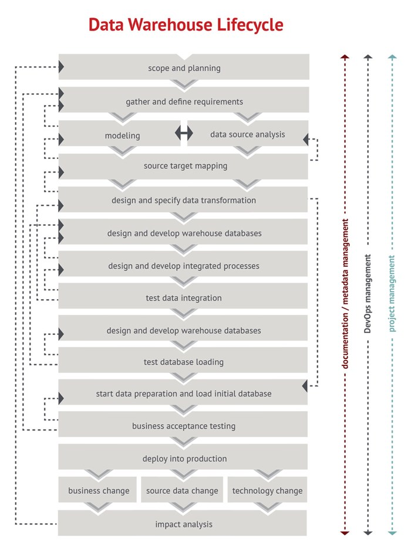

# Business Intelligence and Data Warehouse Course

## Session 5

The topic of this session is **Data Modelling** (in particular, data warehouse modelling). This repository includes the content discussed in class:

  - Datasets
  - Videos
  - Articles

## Main Concepts

  - Data Warehouse design and implementation

## How to use this content

  - Watch the videos
  - If you want to reproduce download the dataset (sakila-dwh) and install the programs
  - Required Software:
	  - MySQL
	  - MySQL Workbench
  - All schemas have been created with MySQL Workbench.
  
## What you can learn in the videos

  - [Loading the Sakila Data Warehouse](https://vimeo.com/242391229)
  - [MySQL Workbench - Publishing a Schema](https://vimeo.com/234888753)
  
## FAQ

### How to choose between CIF, MD or Data Vault?

  - CIF (Inmon): Easy to maintain; Structured; Easier data mining; Timely to build
  - MD (Kimball): Start small, scale big; Faster ROI; Analytical Tools; Low reusability
  - Data Vault (Lyndsted); Backend Data Warehouse; Multiple sources; Full history; Incremental build; Up-front work; Long-term payoff; Many joins

### Is there a data warehouse lifecycle?

Yes. It comprises many iterative steps.

### Any tips for improving MySQL performance?

Check this article: [https://www.catswhocode.com/blog/10-sql-tips-to-speed-up-your-database](https://www.catswhocode.com/blog/10-sql-tips-to-speed-up-your-database)
