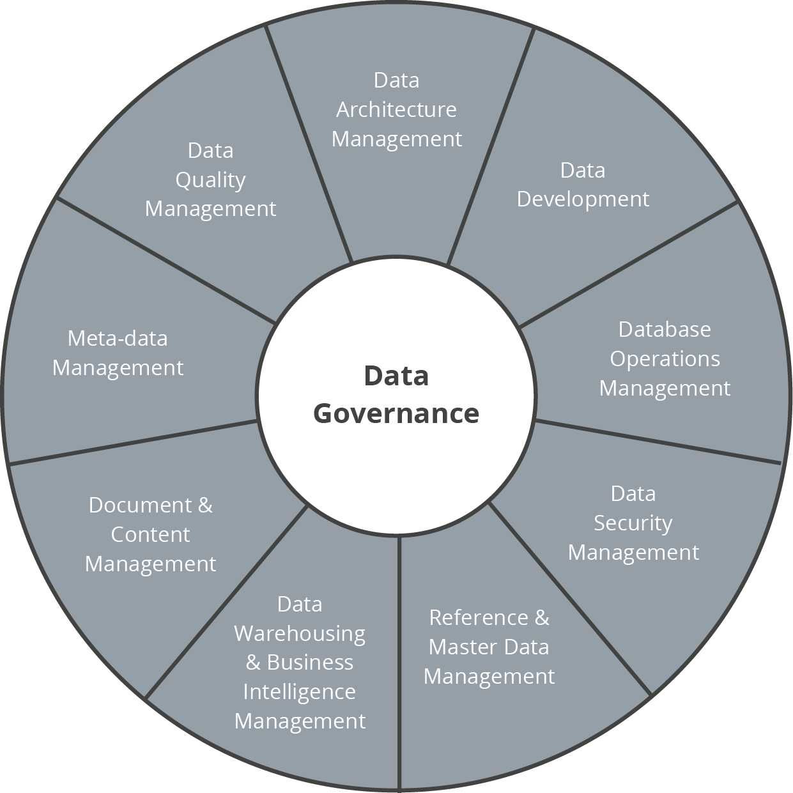

# Business Intelligence and Data Warehouse Course

## Session 15

The topic of this session is **Data Governance**. This repository includes the extra content discussed in class:

  - Articles

## Main concepts

  - What is Data Governance
  - Data Governance Tasks
  - Data Governance Functions
  - Data Governance Roles
  

## FAQ

### What if the latest version of Tableau is not working for my OS?

Check the compatibility and download a previous release compatible with your OS from this [website](https://www.tableau.com/support/releases).

### Is there more than one version of Tableau?

Yes. There are four versions.

  - [Tableau Reader](https://www.tableau.com/products/reader): free, only for consumption, for business stakeholders
  - [Tableau Desktop](https://www.tableau.com/products/trial): 14-days trial, based on license, for developers/business analysts
  - [Tableau Public](https://public.tableau.com/s/): for developers, free, cloud-based, public data and workbooks
  - [Tableau Server](https://www.tableau.com/products/server/options): for companies, for developers/business analysts, they can share their analysis with the rest of the company

Tableau has a data preparation tool as well: [Tableau Prep](https://www.tableau.com/products/prep).

### I need a DG (Data Governance) platform. Which options do I have?

Many options: [Alation](https://alation.com), [Ataccama](https://www.ataccama.com), [Collibra](https://www.collibra.com), [Informatica](https://www.informatica.com), [Information Builders](https://www.informationbuilders.com), [Okera](https://www.okera.com), [Orchestra Networks](http://www.orchestranetworks.com), [Reltio](http://www.reltio.com), [Talend](https://www.talend.com/solutions/information-technology/data-governance-mdm/), [Tamr](https://www.tamr.com), [Waterline Data](https://www.waterlinedata.com) among many others.

## References

  - [DAMA International](https://dama.org)
  - [DMBOK flashcards](https://quizlet.com/subject/DMBOK/)
  - [EU General Data Protection Regulation ](https://www.eugdpr.org)
  - [IEEE Spectrum - Your Guide to the GDPR](https://spectrum.ieee.org/telecom/internet/your-guide-to-the-gdpr)
  - [My Data Request](https://mydatarequest.com)
  - [ODI - Data Ethics Canvas](https://theodi.org/article/data-ethics-canvas/)
